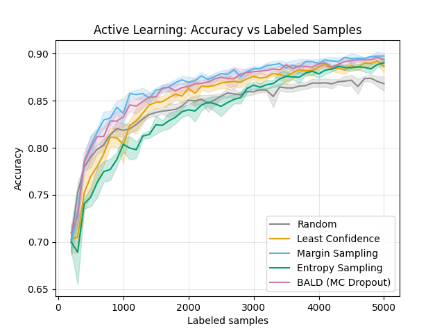

 # Active Learning Benchmark

Active Learning (AL) case study using the Fashion-MNIST dataset to demonstrate
how AL can significantly reduce the labeling cost of training ML models.

The biggest bottleneck in many ML pipelines is not the model itself, but the
resources required to label data. Active Learning addresses this by starting
with a small labeled pool and letting the model decide which unlabeled samples
to query next — maximizing accuracy while minimizing the number of labels needed.

In each iteration, the model selects the most informative samples from the
unlabeled pool, passes them to an oracle (in this case, pre-labeled data treated
as unlabeled) for annotation, and retrains on the updated labeled pool. This
continues until a labeling budget is reached.

This project implements and compares 5 acquisition strategies against a random
baseline across 5 random seeds to ensure reproducibility:
- Random (baseline)
- Least Confidence
- Margin Sampling
- Entropy Sampling
- BALD (Bayesian Active Learning by Disagreement)

## Installation

1. Clone the repository:
```bash
git clone https://github.com/DanielSainz1/active-learning-tfg.git
cd active-learning-benchmark

2. Create and activate a virtual environment:
python -m venv .venv
.venv\Scripts\activate  # Windows
source .venv/bin/activate  # Linux/Mac

3. Install dependencies:
pip install -r requirements.txt

## Usage

### Run all experiments automatically
```bash
python run_all.py
This runs all 25 experiments (5 strategies × 5 seeds) and generates the plots automatically.

Run a single experiment

python run_experiment.py --strategy <strategy> --seed <seed>

Available strategies: random, least_confidence, margin, entropy, bald

Example:
python run_experiment.py --strategy margin --seed 42

Generate plots and metrics

python plot_results.py

This generates results.png and prints AUC and Label Efficiency for each strategy.
```

## Project Structure

  active-learning-benchmark/
  ├── config.py                  # All hyperparameters and experiment settings
  ├── run_experiment.py          # Main Active Learning loop
  ├── plot_results.py            # Generate plots and compute metrics
  ├── requirements.txt           # Project dependencies
  │
  ├── datasets/
  │   └── fashion_mnist.py       # Dataset loading and stratified split
  │
  ├── models/
  │   └── cnn_fashion.py         # CNN architecture for Fashion-MNIST
  │
  ├── engine/
  │   └── trainer.py             # Training and evaluation functions
  │
  ├── strategies/
  │   ├── random_sampling.py     # Random baseline
  │   ├── least_confidence.py    # Least Confidence strategy
  │   ├── margin.py              # Margin Sampling strategy
  │   ├── entropy.py             # Entropy Sampling strategy
  │   └── bald.py                # BALD (MC Dropout) strategy
  │
  └── results/                   # JSON results per strategy and seed

## Results

  Experiments run on Fashion-MNIST with `budget=5000`, `train_epochs=20`, `query_batch_size=100` and 5 seeds.

  ### AUC (higher is better)

  | Strategy | AUC |
  |---|---|
  | Margin Sampling | 4161.24 |
  | BALD | 4140.98 |
  | Least Confidence | 4094.50 |
  | Random | 4054.24 |
  | Entropy Sampling | 4030.42 |

  ### Label Efficiency (samples needed to reach accuracy threshold)

  | Strategy | 0.80 | 0.85 | 0.88 |
  |---|---|---|---|
  | Margin Sampling | 500 | 1100 | 2700 |
  | BALD | 600 | 1400 | 2900 |
  | Least Confidence | 800 | 1700 | 3700 |
  | Random | 700 | 2000 | never |
  | Entropy Sampling | 1000 | 2700 | 3900 |

  